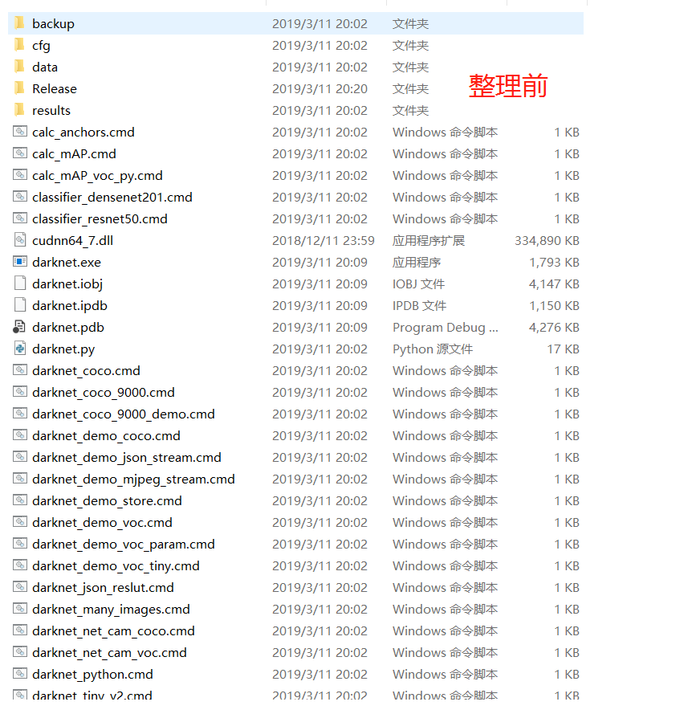
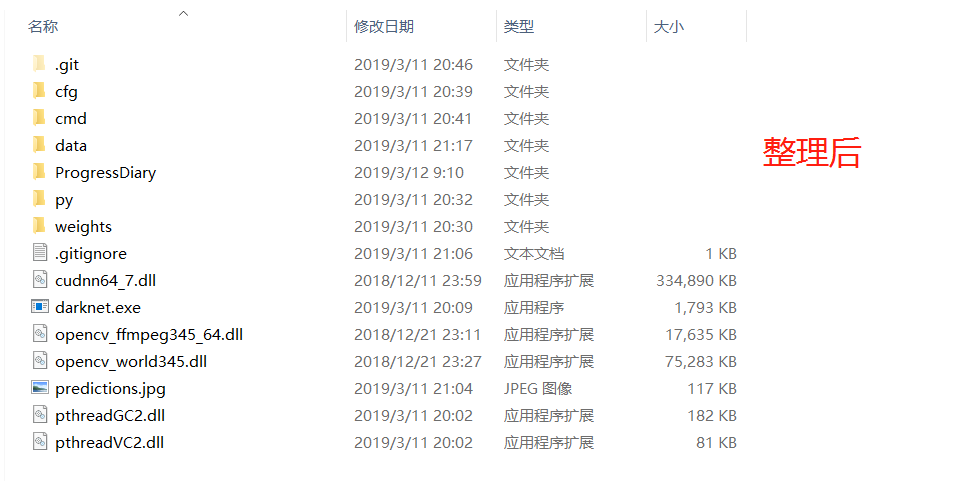

# 2019-03-11

今天晚上正式开始毕业设计进度。

## 完成事项
- [X] 记录编译**darknet.exe**踩过的坑 https://vonsdite.cn/posts/25f3339.html
- [X] 强迫症整理了下build出来的**X64文件夹**

## 吐槽
在`2019-03-09`第一次编译成功**darknet.exe**, 然而也踩了很多的坑, 白白的浪费了很多时间

_(根据作者介绍的`using vcpkg`方法: 进行编译, 删掉vs2015, 安装vs2017, 安装vcpkg, 安装CUDA, 安装cuDNN; vcpkg安装pthread、opencv[cuda]花费了2.7个小时, 进行编译, 失败, 反复尝试, 无果, 均失败; --> 卸载vs2017, 使用`legacy way`: 安装vs2015, 安装opencv, 最终成功编译。)_

于今日`2019-03-11`, 重新又踩了各种坑, 并做下记录, https://vonsdite.cn/posts/25f3339.html

## 整理前后

