# 2019-03-12

## 完成事项
- [X] 使用**darknet.exe**跑了一遍官网的例子
- [x] 应用场景考虑 => 考虑做监控录像无用信息过滤, 提取关键视频片段
- [x] Training YOLO on VOC, ~~_失败, 待解决_~~ **03.13解决了, 03.14 表示可以无GPU跑, 数据集没问题了, GPU均需要在老师机子跑**
- [x] Training YOLO on coco **03.14 表示可以无GPU跑, 数据集没问题了, GPU均需要在老师机子跑**

## 明日需要做的
1. 研究一下怎么训练
2. 如何结合上python或者C++
3. 继续翻阅官网中的内容, 收集更多的信息
4. 研究一下怎么保存处理过的视频

## 1. 跑官网例子
使用**YOLOV3**已经训练好的模型来跑跑例子。

### 1.1 单张图片
```
darknet detect cfg/yolov3.cfg weights/yolov3.weights data/dog.jpg
```
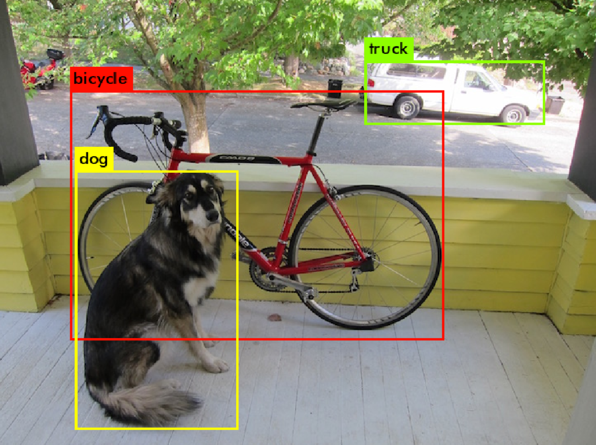
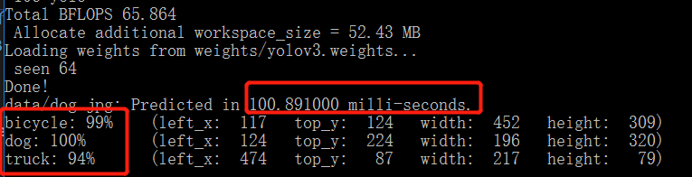

### 1.2 多张图片
```
darknet detect cfg/yolov3.cfg weights/yolov3.weights
```

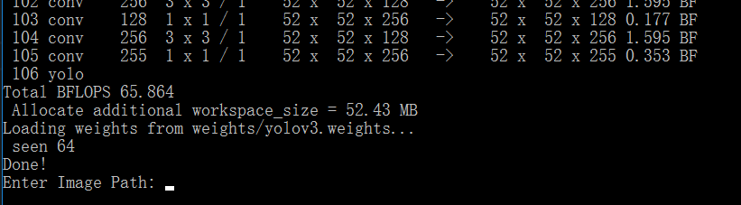


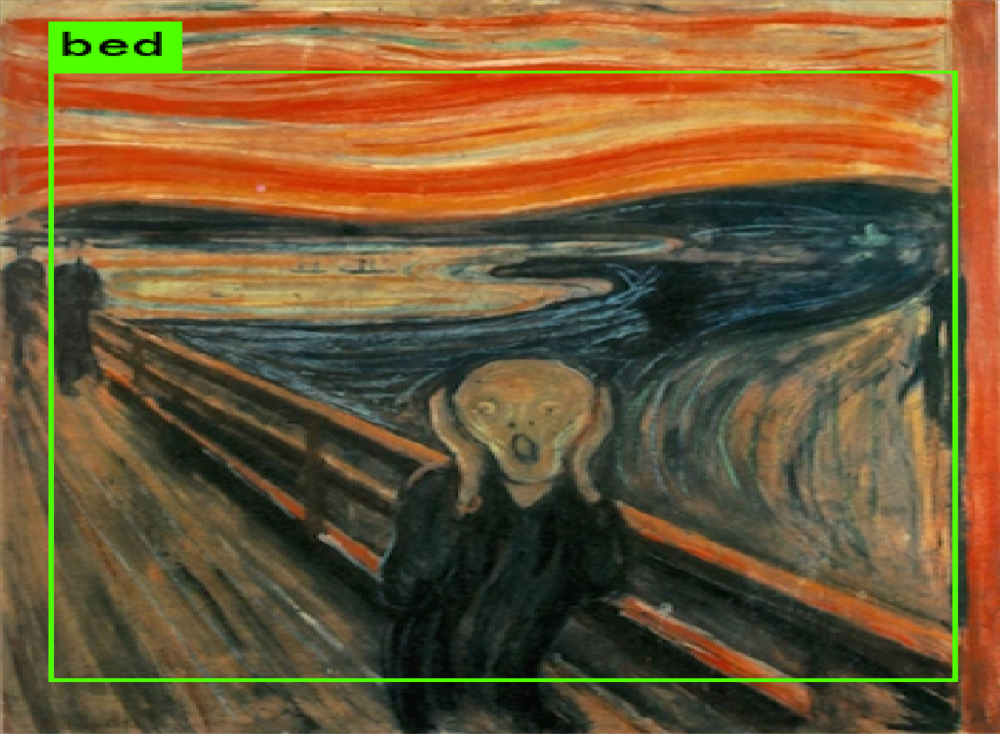
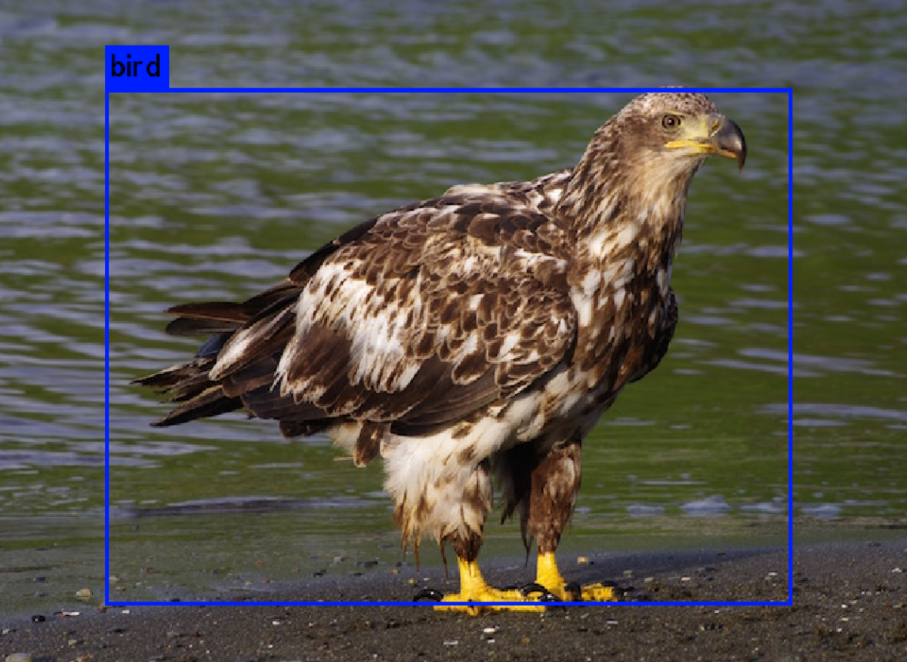
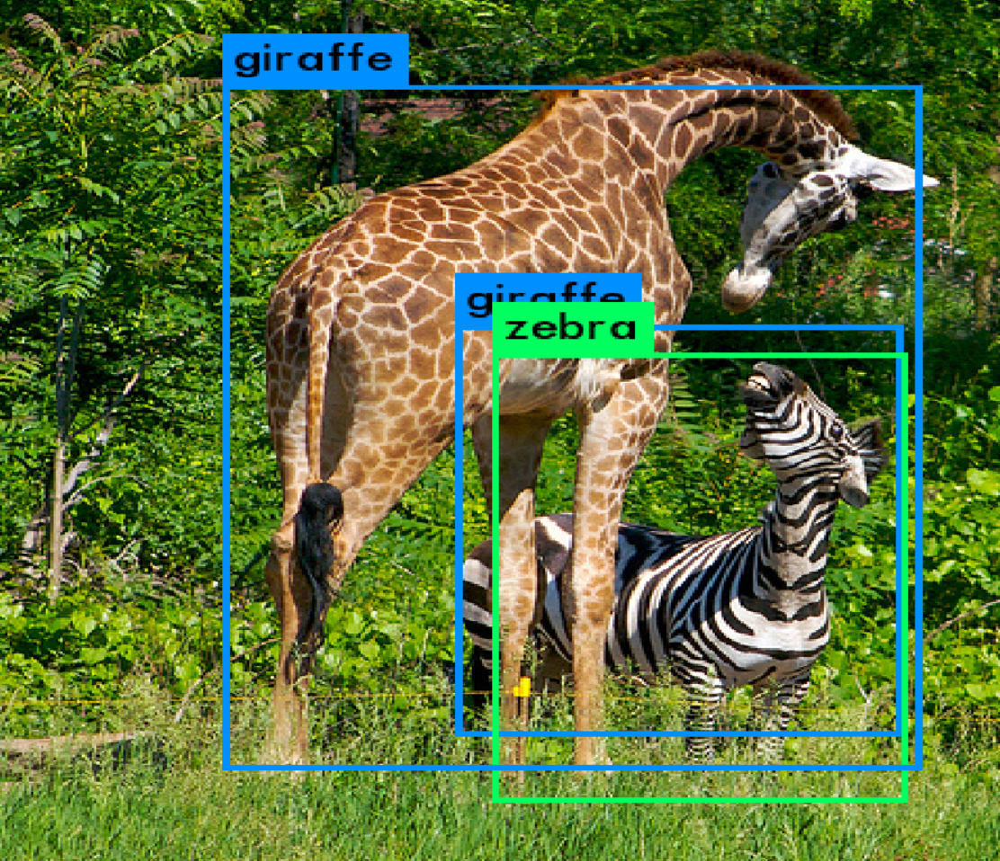

### 1.3 yolov3-tiny
非常小的模型, 可应用于一些比较限制的环境(_对速度很是追求的_)
```
darknet detect cfg/yolov3-tiny.cfg weights/yolov3-tiny.weights data/dog.jpg
```

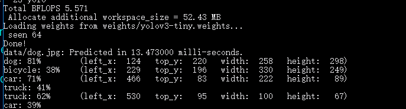

### 1.4 摄像头测试
```
 .\darknet.exe detector demo .\cfg\coco.data .\cfg\yolov3.cfg .\weights\yolov3.weights
```
**难以置信的实时识别！！！ 真的太强了**
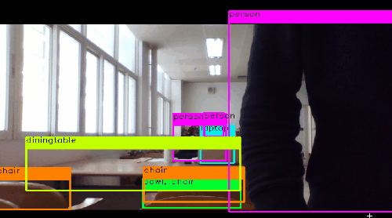

## 2. 尝试训练模型

### 2.1 Training YOLO on VOC
训练失败, 
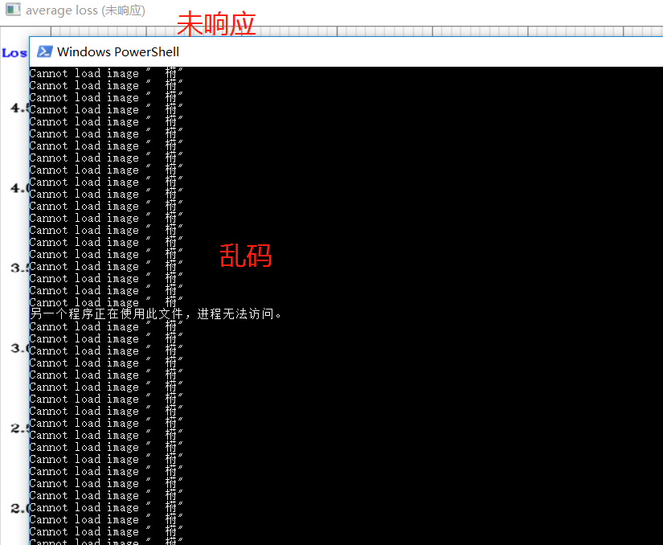


如图的办法试了两种, 但也不成功, 见Issue https://github.com/AlexeyAB/darknet/issues/2124

**很有可能是因为我显存不够..., 但乱码又是另一个问题吧**
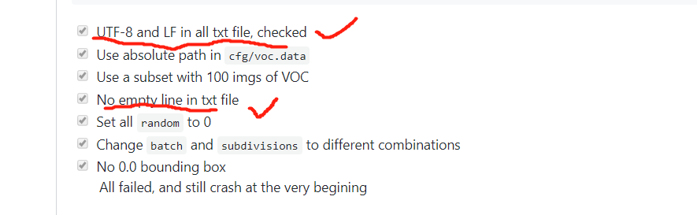

### 2.2 Training YOLO on coco
算了吧, windows还是不要用`scripts/get_coco_dataset.sh`这个脚本了, 查看脚本逐个下载即可。

~~下载COCO完整数据, 需要用到`scripts/get_coco_dataset.sh`~~
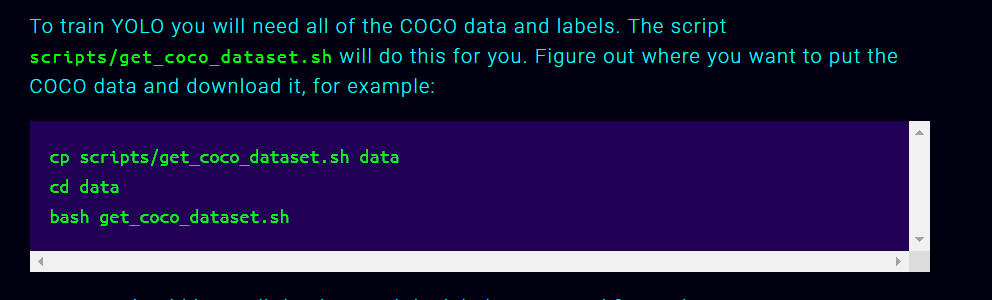

~~因为是**linux**脚本, 所以先配置需要的工具~~
- [x] ~~git命令行工具~~
- [x] ~~wget for windows~~
- [x] ~~unzip for windows~~
- [x] ~~tar for windows~~

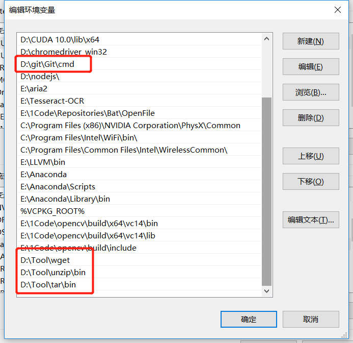


