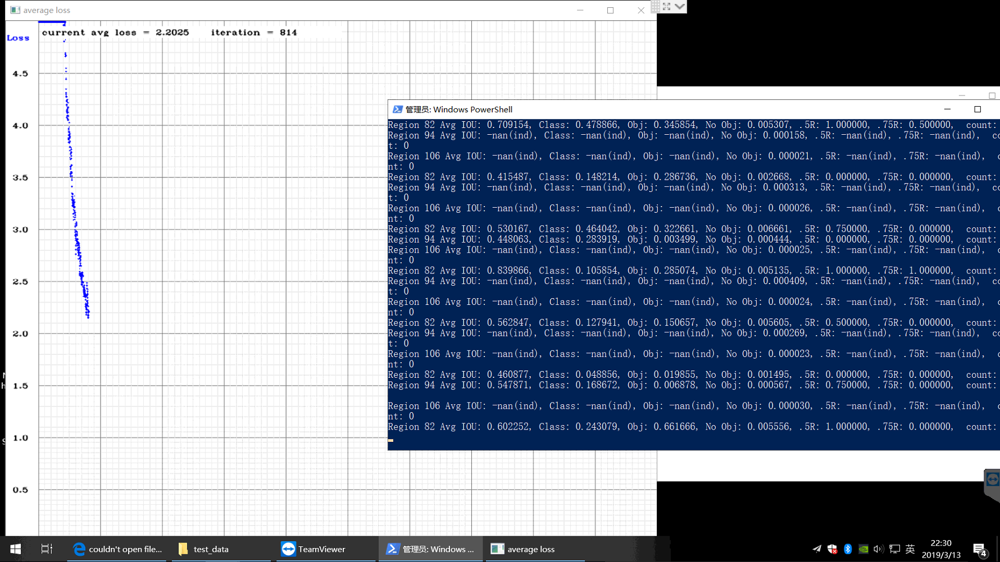
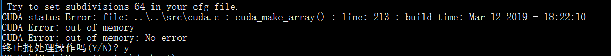

# 2019-03-13

## 完成事项
- [x] 下载COCO训练集
- [x] Training YOLO on VOC, _在老师的电脑跑了一遍, 也最终发现了乱码的原因_**乱码解决**
- [x] 导出处理后的视频, **03.14解决** ~~**Failed on my computer**~~
- [x] Training YOLO on coco **Failed on my computer** **03.14 表示可以无GPU跑, 数据集没问题了, GPU均需要在老师机子跑**
- [ ] 收集更多相关信息, 知识储备仍不足 **今天收集到了不少的信息! nice**

## 明日需要做的
1. 看看保存处理过的视频出错在哪
2. 继续翻阅官网中的内容、和网上 收集更多的信息
3. 如何结合上python或者C++

## Training YOLO on VOC
成功跑了一遍**VOC数据集**, 在老师电脑上跑的

自己的电脑仍然跑不了

## 解决乱码问题
记录在另一篇文章中, https://vonsdite.cn/posts/e401f4af.html

## 导出视频问题
1. 在老师的电脑上能成功导出视频
2. 在自己电脑上导出的视频却是**0kb**的, 需要考虑如何解决

## 吐槽
- 9:30 => 今天发现...emmmm, 原来**AlexeyAB**有发布编译好的`darknet.exe`, 行吧, 怪我没看细。 
- 10:46 => 我擦, 作者编译的`darknet.exe`在我这一运行就崩溃。虽然作者把opencv的dll带上了, 但版本和我的不一样,**确实是opencv版本问题, 03-14证实** ~~是opencv的问题?, 尝试去掉opencv的环境变量, 我编译的依旧能正常运行, 可能是兼容性问题?~~

