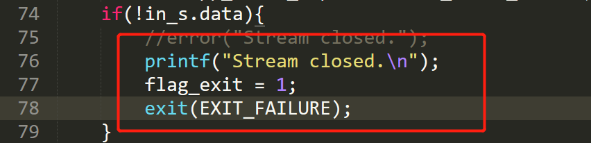
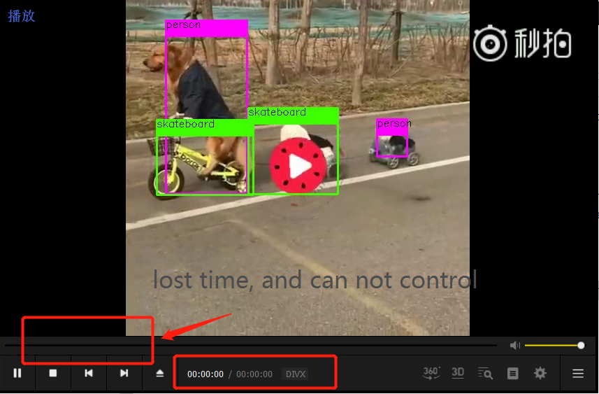
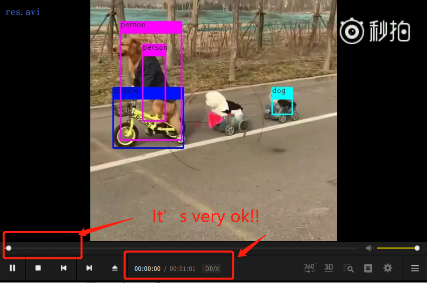
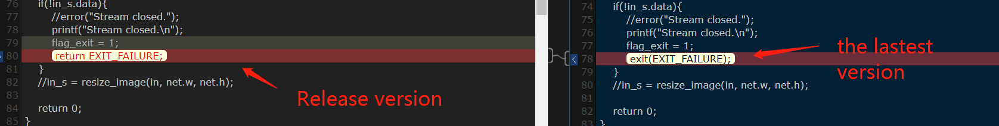
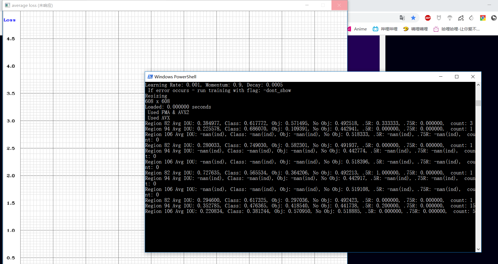
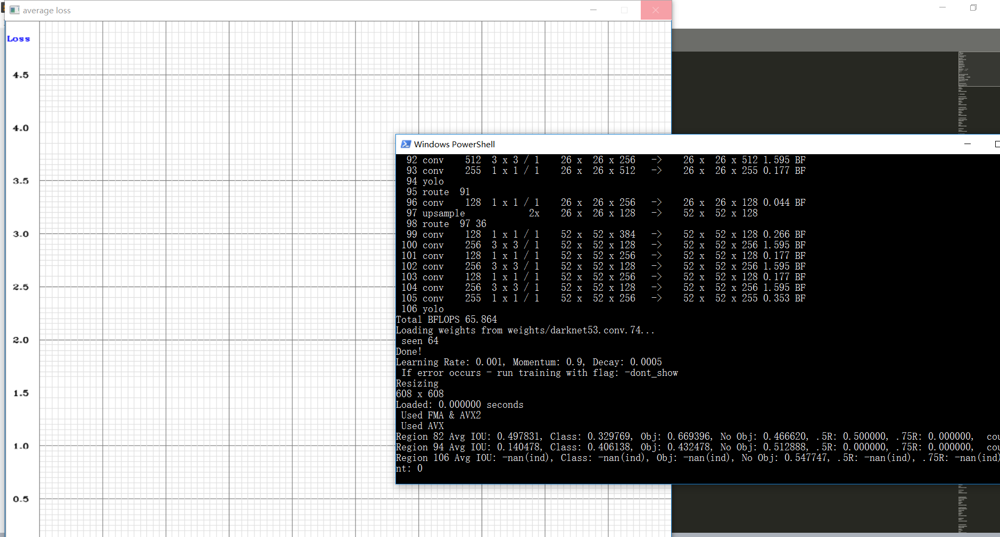

# 2019-03-14

## 完成事项
- [X] 成功导出了视频
- [x] 尝试无GPU版本跑VOC数据集和COCO数据集
- [x] 翻阅官网、github 收集更多的信息
- [x] webcam opencv3.4.0 退出会崩溃!!!**03-15解决了**
- [x] webcam保存问题 **03-15解决了**
- [ ] 如何结合上python或者C++

## 1. 导出视频
昨天情况
> 1. 在老师的电脑上能成功导出视频
> 2. 在自己电脑上导出的视频却是**0kb**的, 需要考虑如何解决


今天, 主要是看到自己电脑上运行视频检测并保存时最后命令行输出了如下一行
```
Stream closed.
```
而在老师那边输出的是
```
input video stream closed. 
output_video_writer closed.
```
所以就去源码`demo.c`查找`Stream closed.`, 发现是一个错误, 然后直接退出程序


### 1.1 考虑opencv问题
因为之前尝试使用作者发布的**Release**版本, 但可能opencv版本不对, 导致失败了, 所以这次尝试更改opencv的版本。

同时老师的那边的环境也是opencv340, 而我是opencv345。

更改opencv为340, 然后重新编译, 再次检测保存视频。
结果得到的不是**0kb**的视频了, 但是也有问题在, 视频的时间没有了, 也不能拖动时间轴。

而且我的命令行输出还是 `Stream closed.`

emmmmm, 这个时候想起老师说他使用的是别人提供的**Release**版本, 也正好看看上次为什么用**Release**版本失败。

尝试后发现, 成功导出了视频, 而且时间也是有的, 时间轴也可以拖动。
 

### 1.2 考虑源码问题
这么说来, Release版本是成功的, 那么为什么呢。
感觉可能最新版本lastest和Release版本可能代码上有变化,
diff了一下`demo.c`, 果然不同, `return`改成了`exit`了


修改源码为 `return (void *)EXIT_FAILURE;`, 编译, 再次检测保存视频, 最终完美的导出了视频。

但新版本为什么要修改为`exit`呢? 我只好提 issue问问作者了... https://github.com/AlexeyAB/darknet/issues/2601


## 2. 无gpu版本跑样本集
只能意思意思一下, 实在是太慢了。 但也证实实际上**可以跑**

### 2.1 VOC 


### 2.2 COCO



