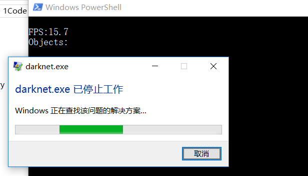
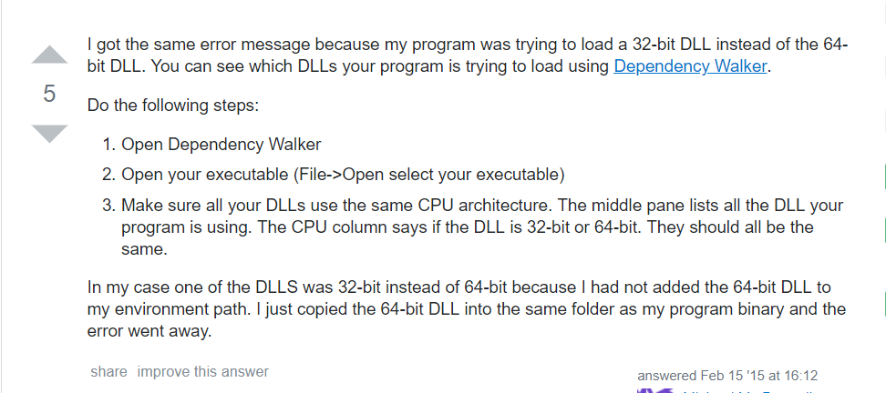
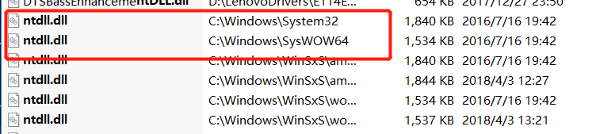
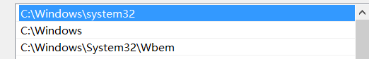
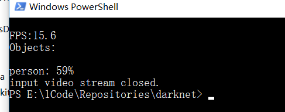
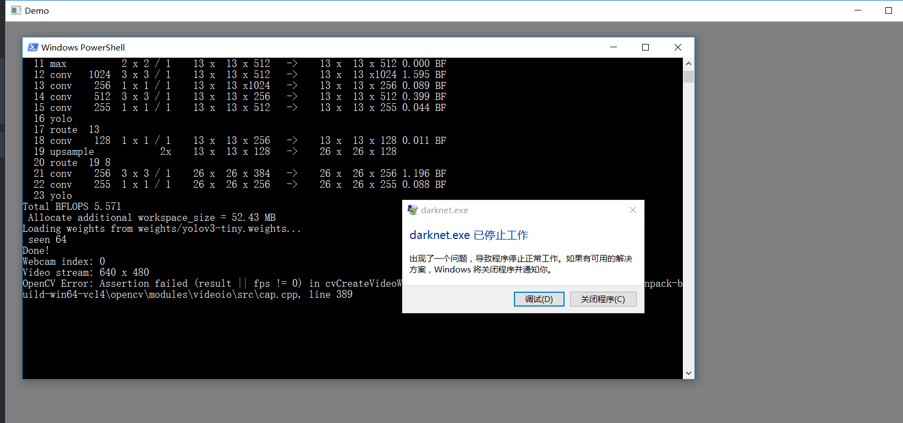
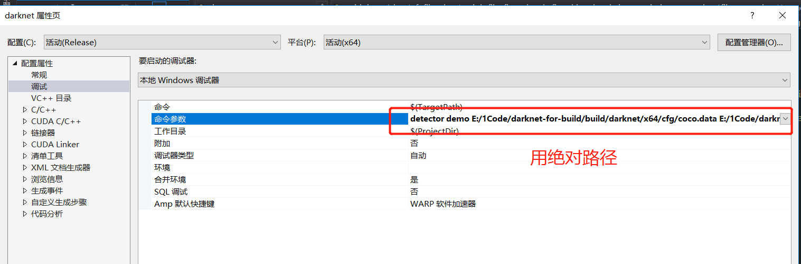
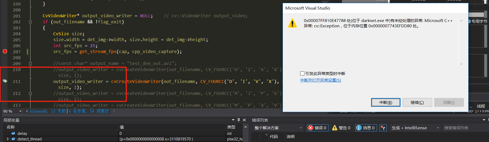
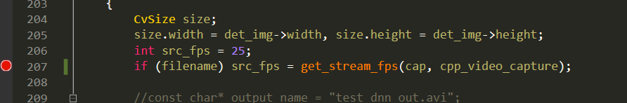
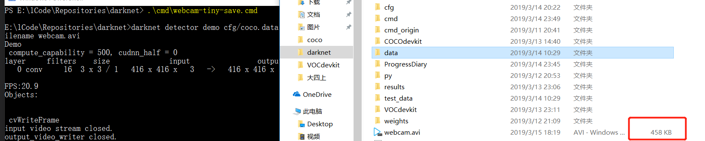

# 2019-03-15

## 完成事项
- [x] 解决webcam退出崩溃问题(后来发现并不是完全解决)
- [x] webcam 保存视频功能
- [x] webcam 退出后仍然崩溃 **03-17解决**
- [ ] 开始做界面, Qt or MFC or PyQt5

## 1. webcam崩溃(后来发现并不是完全解决)
改用opencv 3.4.0后, 发现webcam测试时, 退出时, 程序会崩溃。如图


根据作者的说法, 尝试更换**更低版本**的opencv, 结果仍然崩溃。

然后尝试对源码单步调试, 最终定位到了崩溃的原因如图
(_真的是边打断点, 边逐层深入, 调试很爽!_)


中断的原因是`ntdll.dll`, 但是报的错误说是**在darknet.exe文件附近**(但是没找到, 那估计是在**环境变量**某处), 而且考虑到是关闭摄像头时报错, 那就是和`opencv`有关系。
`Stack Overflow`搜索了下`opencv`和`ntdll.dll`之间出的问题, 找到如下解决方案



意思就是说, 首先要知道你用的程序用的是**32位**的`ntdll.dll`还是**64位**的`ntdll.dll`, 可以使用[dependency walker](http://www.dependencywalker.com/)来查看你的程序, 即`exe`

因为我们编译的**darknet.exe**是64位的, 那肯定是**64位**的`ntdll.dll`

用everything搜索`ntdll.dll`

原来这个dll是**系统dll**, 难怪没在darknet目录下找到它。
我们来查看下**环境变量**, 


可以看到`C:\Windows\system32`这个环境变量在第一个, 那肯定是读取了**32位**的`ntdll.dll`。

解决办法就是复制`C:\Windows\SysWOW64`的`ntdll.dll`到`darknet.exe`附近即可

**优雅退出!**


## 2. webcam保存视频就崩溃
在使用`darknet`打开摄像头进行目标检测时, 除了想实时监测外, 还想保存检测的视频, 就可以使用`-out_filename`这个参数
比如下面的命令
```
darknet detector demo cfg/coco.data cfg/yolov3-tiny.cfg weights/yolov3-tiny.weights -out_filename webcam.avi
```

但是却直接遇到了崩溃, 明明**不保存视频时**不会奔溃的, 为什么一使用`-out_filename`就崩溃了


### 2.1 进行调试
遇到这种问题, 只能通过**调试源代码**才能查出代码崩溃的原因

1. 先设置好命令行参数, 注意使用绝对路径, `coco.data`里面的`names`参数也要用绝对路径(相对路径也可以, 但容易出错, 出错程序会一闪而过, 通过**单步调试**可知为什么闪退了)


2. 进行摄像头保存调试, 即 使用参数`-out_filename`


通过**单步**调试找到中断点在这里,
思考到我们调用的是摄像头, 应该是涉及不到`get_stream_fps`这个函数, 应该默认为25即可。
修改代码为如图,
```C++
if (filename) src_fps = get_stream_fps(cap, cpp_video_capture);
```


再次编译, 测试摄像头录像保存


成功导出了录像视频
