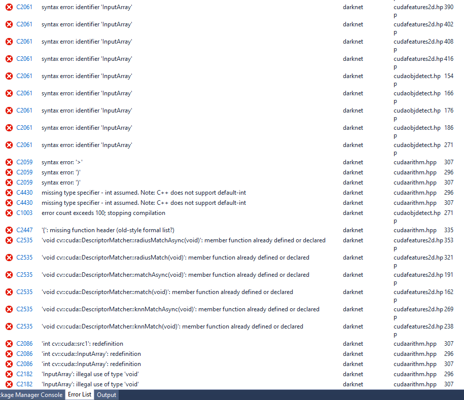
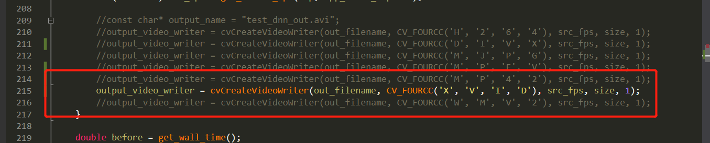

# 2019-03-17

## 完成事项
- [x] 使用自己编译好的opencv与darknet进行编译
- [x] 解决webcam退出崩溃
- [x] 解决稍高版本`opencv`导出视频为0kb

## 自己的opencv与darknet一起编译发生失败
苦苦编译了三个小时的opencv, 却与darknet一起编译失败。

解决办法：https://vonsdite.cn/posts/1a00e4df.html

## 解决webcam退出崩溃
换用较高版本的`opencv`

## 解决稍高版本`opencv`导出视频为0kb
安装编解码器 [xvid](https://www.xvidmovies.com/codec/)
修改code为: 

