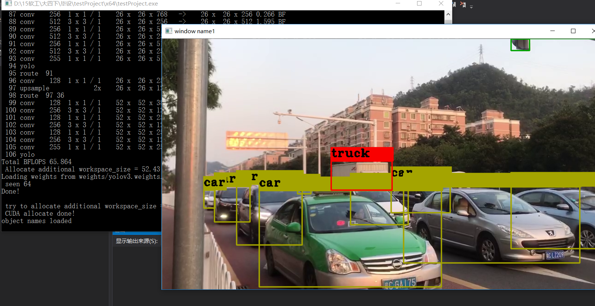

# 2019-03-19
## 完成事项
- [x] 温故动态链接库的使用
- [x] 编译`darknet`动态链接库`yolo_cpp_dll`
- [x] 简单示例使用`yolo_cpp_dll`
- [ ] 测试网络摄像头是否正常(**失败**)

## 温故动态链接库
观看孙鑫**动态链接库**介绍

## 编译`yolo_cpp_dll`
通过`darknet`的项目, 编译出`yolo_cpp_dll`

## 简单示例`yolo_cpp_dll`

