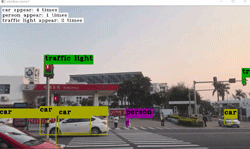
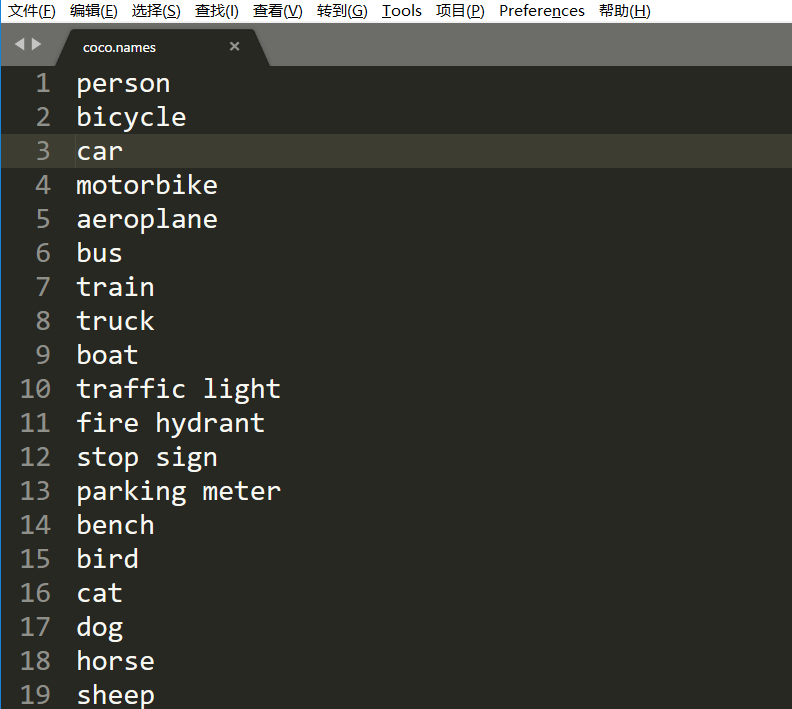
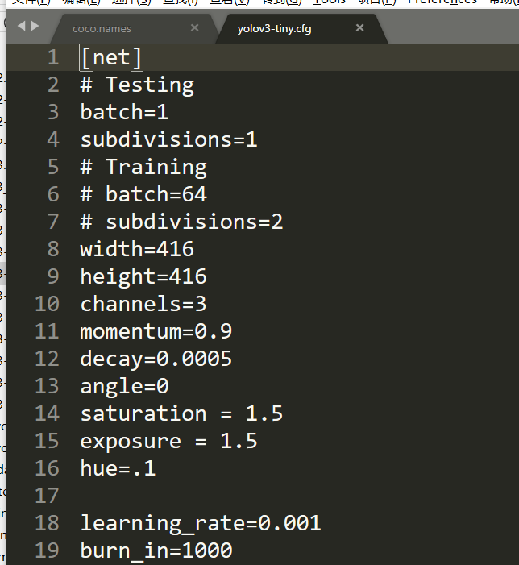
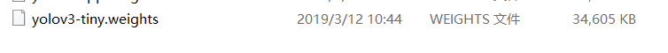
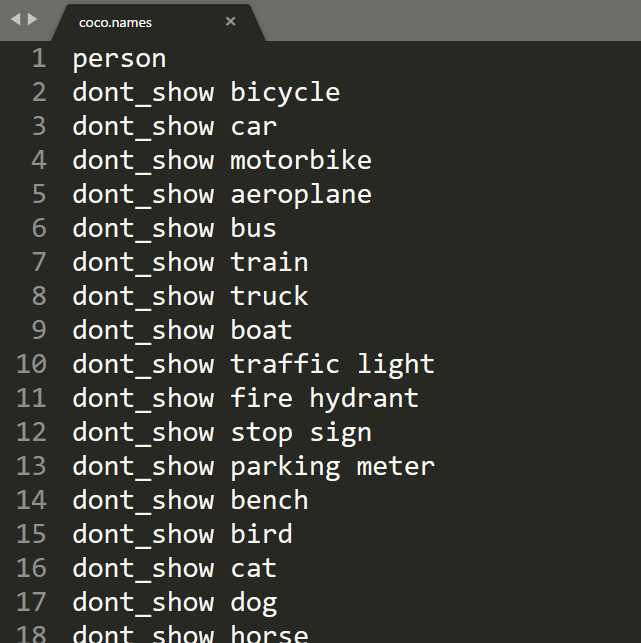
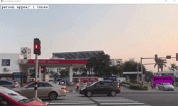

# 2019-03-25
## 完成事项
- [X] 实现检测某物是否出现在画面的API
- [X] 实现检测画面上某物出现次数的API
- [X] 实现检测画面上所有对象出现次数的API
- [X] 实现视频画面有效片段提取API(即提取指定目标出现的片段)
- [X] 实现加入`dont_show`可不检测该对象的功能

## 各API功能介绍(见[2019-03-27](https://github.com/VonSdite/MonitoringVideoEffectiveExtraction/blob/master/ProgressDiary/2019-03-27.md) 已重构)
```C++
// 提取视频有效片段, 有2个重载函数
// 支持输入视频文件或cv::VideoCapture对象
// 可设置要提取的目标对象
// 可设置目标最大消失阈值, 即目标在画面消息了多少秒分一个片段
// 可选择是否要绘制框住对象的框
// 多线程可获取进度
// 可设置导出视频的路径、命名前缀
// 可设置置信度阈值下限(即分类时若大于该值, 才认定对象属于该分类)
INTELLIGENT_API extract(...);       

// 检测目标是否出现, 有6个重载函数
// 支持单个目标检测, 或一组目标检测
// 可框住检测到的目标
// 可设置置信度阈值下限(即分类时若大于该值, 才认定对象属于该分类)
INTELLIGENT_API bool detect_something_appear(...);

// 检测目标出现次数, 有6个重载函数
// 支持单个目标检测, 或一组目标检测
// 可框住检测到的目标
// 可左上角显示各目标出现次数
// 可设置置信度阈值下限(即分类时若大于该值, 才认定对象属于该分类)
INTELLIGENT_API int detect_something_appear_times(...);

// 检测画面所有目标出现次数, 有3个重载函数
// 可框住检测到的目标
// 可左上角显示各目标出现次数
// 可设置置信度阈值下限(即分类时若大于该值, 才认定对象属于该分类)
INTELLIGENT_API void detect_all_appear_times(...);
```

### API的用途
`detect_something_appear`
返回值是布尔值
可应用的场景:
1. 视频监控系统可使用该API来**判断何时需要进行录像**, 以此剔除冗余视频内容, 使有效存储周期提升(因为存储周期有限, 监控摄像头一般满了就会覆盖存储, 而剔除了冗余的内容, 就有更多的空间来保存有效视频内容, 而且还减少了回看操作员的负担)
2. 视频监控系统可使用该API来**设置看护区域**, 即某些看护区域在某段时间内不允许有人出入, 就可以使用该API来实现该功能, 且还能利用这个来判断当有人出现在看护区域时, 进行**响铃报警**或者**短信通知主人**(地铁高速公路等禁止进入的区域和场所; 晚上睡觉, 想把大门口设置为看护区域; 银行押运钱时, 设置某区域为看护区域;幼儿园午觉, 用来看护哪些调皮蛋偷偷跑出来)

`detect_somthing_appear_times`和`detect_all_appear_times`功能相似
可应用的场景:
1. 视频监控可以使用该API来实现**计数**, 比如**路口车辆通过数**, 或者**统计路口行人密度**, 或者**统计公交车上拥挤程度**, 或者为**以进行人流量的统计**, 为商业网点、大型超市等提供依据, 方便业务分析
2. 视频监控可以使用该API来实现**人员聚集检测**, 对指定区域内出现的人员非法集中、群体性事件进行报警, 可以广泛用于广场、政府机关等场所, 避免非法游行集会等恶性事件发生。

更多的扩展:
因为只要更换**cfg文件**和**weights权重文件**(前提是使用数据训练好), 就可以实现更多目标检测, 比如视频监控对**违禁物品**的监控等

### 演示
演示`detect_all_appear_times` API, 用于检测视频画面上**所有能检测到的对象**出现的次数
其余API的功能相似


左上角会标注出出现的次数。
可以通过设置
- `bool draw_box`来控制是否要显示框住的对象的框
- `bool show_times`来控制左上角是否显示检测到对象出现的次数

### `extract`(见[2019-03-27](https://github.com/VonSdite/MonitoringVideoEffectiveExtraction/blob/master/ProgressDiary/2019-03-27.md) 已重构)
用于提取视频中出现某些目标对象的片段

<details>
<summary>函数声明</summary>

```c++
/*
参数:
    cv::VideoCapture& cap:						视频捕获对象(请不要传摄像头的)
    std::vector<char *>& obj_to_extract:		需要提取的视频中所包含的目标组
    const char* save_path="./":					提取出来的视频保存的路径
    const char * prefix=NULL:					提取出来的视频命名的前缀
    int disappear_thresh=DISAPPEAR_THREASH:		所检测的目标最大消失的阈值, 秒为单位;比如设置为5,表示5秒内目标没出现, 则分一个片段
    bool draw_box=false:						是否需要绘制框住目标的框框
    float thresh=DEFAULT_THREASH:				置信度的下限(即分类时若大于该值, 才认定对象属于该分类)
    double* progress_rate=NULL:					提取的进度率, 多线程的时候可以拿这个来显示进度

返回值:
    bool:										表明提取是否成功
*/
INTELLIGENT_API bool extract(
    cv::VideoCapture& cap,
    std::vector<char *>& obj_to_extract,
    const char* save_path="./",
    const char * prefix=NULL,
    int disappear_thresh=DISAPPEAR_THREASH,
    bool draw_box=false,
    float thresh=DEFAULT_THREASH, 
    double* progress_rate=NULL
);

/*
参数:
    const char* names_file:						视频文件的路径
    std::vector<char *>& obj_to_extract:		需要提取的视频中所包含的目标组
    const char* save_path="./":					提取出来的视频保存的路径
    const char * prefix=NULL:					提取出来的视频命名的前缀
    int disappear_thresh=DISAPPEAR_THREASH:		所检测的目标最大消失的阈值, 秒为单位;比如设置为5,表示5秒内目标没出现, 则分一个片段
    bool draw_box=false:						是否需要绘制框住目标的框框
    float thresh=DEFAULT_THREASH:				置信度的下限(即分类时若大于该值, 才认定对象属于该分类)
    double* progress_rate=NULL:					提取的进度率, 多线程的时候可以拿这个来显示进度

返回值:
    bool:										表明提取是否成功
*/
INTELLIGENT_API bool extract(
    const char* names_file, 
    std::vector<char *>& obj_to_extract, 
    const char* save_path = "./", 
    const char * prefix = NULL, 
    int disappear_thresh=DISAPPEAR_THREASH, 
    bool draw_box = false,
    float thresh=DEFAULT_THREASH, 
    double* progress_rate=NULL
);
```

</details>

### `detect_all_appear_times`(见[2019-03-27](https://github.com/VonSdite/MonitoringVideoEffectiveExtraction/blob/master/ProgressDiary/2019-03-27.md) 已重构)
检测画面上所有对象出现的次数

<details>
<summary>函数声明</summary>

```c++
/*
参数:
    cv::Mat& mat:                       图片或者视频某帧的矩阵
    std::map<std::string, int>& in_map: 保存检测的对象出现次数的映射表
    bool draw_box=false:                是否绘制框住对象的框
    bool show_times=false:              是否显示检测对象的出现次数
    float thresh=DEFAULT_THREASH:       置信度的下限(即分类时若大于该值, 才认定对象属于该分类)

返回值:
    无返回值
*/
INTELLIGENT_API void detect_all_appear_times(
    cv::Mat& mat, 
    std::map<std::string, int>& in_map, 
    bool draw_box = false,
    bool show_times = false, 
    float thresh = DEFAULT_THREASH
);

/*
参数:
    image_t& img:                       image_t结构体
    std::map<std::string, int>& in_map: 保存检测的对象出现次数的映射表
    float thresh=DEFAULT_THREASH:       置信度的下限(即分类时若大于该值, 才认定对象属于该分类)

返回值:
    无返回值
*/
INTELLIGENT_API void detect_all_appear_times(
    image_t img, 
    std::map<std::string, int>& in_map, 
    float thresh = DEFAULT_THREASH
);

/*
参数:
    std::string image_filename:         图片名
    std::map<std::string, int>& in_map: 保存检测的对象出现次数的映射表
    float thresh=DEFAULT_THREASH:       置信度的下限(即分类时若大于该值, 才认定对象属于该分类)

返回值:
    无返回值
*/
INTELLIGENT_API void detect_all_appear_times(
    std::string image_filename, 
    std::map<std::string, int>& in_map, 
    float thresh = DEFAULT_THREASH
);
```
</details>


### `detect_somthing_appear_times`(见[2019-03-27](https://github.com/VonSdite/MonitoringVideoEffectiveExtraction/blob/master/ProgressDiary/2019-03-27.md) 已重构)
检测某物出现的次数, 返回值是`int`
<details>
<summary>函数声明</summary>

```c++
/*
参数:
    cv::Mat& mat:                   图片或者视频某帧的矩阵
    const char* something:          检测的对象
    bool draw_box=false:            是否绘制框住对象的框
    bool show_times=false:          是否显示检测对象的出现次数
    float thresh=DEFAULT_THREASH:   置信度的下限(即分类时若大于该值, 才认定对象属于该分类)

返回值:
    int:                            表明检测对象出现的次数
*/
INTELLIGENT_API int detect_something_appear_times(
    cv::Mat& mat, 
    const char* something, 
    bool draw_box = false, 
    bool show_times = false, 
    float thresh = DEFAULT_THREASH
);

/*
参数:
    image_t& img:                   image_t结构体
    const char* something:          检测的对象
    float thresh=DEFAULT_THREASH:   置信度的下限(即分类时若大于该值, 才认定对象属于该分类)

返回值:
    int:                            表明检测对象出现的次数
*/
INTELLIGENT_API int detect_something_appear_times(
    image_t& img, 
    const char* something, 
    float thresh = DEFAULT_THREASH
);

/*
参数:
    std::string image_filename:     图片名
    const char* something:          检测的对象
    float thresh=DEFAULT_THREASH:   置信度的下限(即分类时若大于该值, 才认定对象属于该分类)

返回值:
    int:                            表明检测对象出现的次数
*/
INTELLIGENT_API int detect_something_appear_times(
    std::string image_filename, 
    const char* something, 
    float thresh = DEFAULT_THREASH
);

/*
参数:
    cv::Mat& mat:						图片或者视频某帧的矩阵
    std::vector<char*>& something:		检测的一组对象
    std::map<std::string, int>& in_map: 记录检测对象出现的次数
    bool draw_box=false:				是否绘制框住对象的框
    bool show_times=false:				是否显示检测对象的出现次数
    float thresh=DEFAULT_THREASH:		置信度的下限(即分类时若大于该值, 才认定对象属于该分类)

返回值:
    无返回值
*/
INTELLIGENT_API void detect_something_appear_times(
    cv::Mat& mat,
    std::vector<char*>& something, 
    std::map<std::string, int>& in_map,
    bool draw_box = false,
    bool show_times = false,
    float thresh = DEFAULT_THREASH
);

/*
参数:
    image_t& img:                       image_t结构体
    std::vector<char*>& something:		检测的一组对象
    std::map<std::string, int>& in_map: 记录检测对象出现的次数
    float thresh=DEFAULT_THREASH:		置信度的下限(即分类时若大于该值, 才认定对象属于该分类)

返回值:
    无返回值
*/
INTELLIGENT_API void detect_something_appear_times(
    image_t& img,
    std::vector<char*>& something,
    std::map<std::string, int>& in_map,
    float thresh = DEFAULT_THREASH
);

/*
参数:
    std::string image_filename:	 	    图片名
    std::vector<char*>& something:		检测的一组对象
    std::map<std::string, int>& in_map: 记录检测对象出现的次数
    float thresh=DEFAULT_THREASH:		置信度的下限(即分类时若大于该值, 才认定对象属于该分类)

返回值:
    无返回值
*/
INTELLIGENT_API void detect_something_appear_times(
    std::string image_filename,
    std::vector<char*>& something,
    std::map<std::string, int>& in_map,
    float thresh = DEFAULT_THREASH
);
```

</details>

### `detect_something_appear`(见[2019-03-27](https://github.com/VonSdite/MonitoringVideoEffectiveExtraction/blob/master/ProgressDiary/2019-03-27.md) 已重构)
检测某物是否出现, 返回值是`bool`

<details>
<summary>函数声明</summary>

```c++
/*
参数:
    cv::Mat& mat:                   图片或者视频某帧的矩阵
    const char* something:          检测的对象
    bool draw_box=false:            是否绘制框住对象的框
    float thresh=DEFAULT_THREASH:   置信度的下限(即分类时若大于该值, 才认定对象属于该分类)

返回值:
    bool:                           表明检测对象是否出现
*/
INTELLIGENT_API bool detect_something_appear(
    cv::Mat& mat, 
    const char* something, 
    bool draw_box = false, 
    float thresh = DEFAULT_THREASH
);

/*
参数:
    image_t& img:                   image_t结构体
    const char* something:          检测的对象
    float thresh=DEFAULT_THREASH:   置信度的下限(即分类时若大于该值, 才认定对象属于该分类)

返回值:
    bool:                           表明检测对象是否出现
*/
INTELLIGENT_API bool detect_something_appear(
    image_t& img, 
    const char* something, 
    float thresh = DEFAULT_THREASH
);

/*
参数:
    std::string image_filename:     图片名
    const char* something:          检测的对象
    float thresh=DEFAULT_THREASH:   置信度的下限(即分类时若大于该值, 才认定对象属于该分类)

返回值:
    bool:                           表明检测对象是否出现
*/
INTELLIGENT_API bool detect_something_appear(
    std::string image_filename, 
    const char* something, 
    float thresh = DEFAULT_THREASH
);

/*
参数:
    cv::Mat& mat:                   图片或者视频某帧的矩阵
    std::vector<char*>& something:	检测的一组对象
    bool draw_box=false:            是否绘制框住对象的框
    float thresh=DEFAULT_THREASH:   置信度的下限(即分类时若大于该值, 才认定对象属于该分类)

返回值:
    bool:                           表明检测对象是否出现
*/
INTELLIGENT_API bool detect_something_appear(
    cv::Mat& mat,
    std::vector<char*>& something,
    bool draw_box = false,
    float thresh = DEFAULT_THREASH
);

/*
参数:
    image_t& img:                   image_t结构体
    std::vector<char*>& something:	检测的一组对象
    float thresh=DEFAULT_THREASH:   置信度的下限(即分类时若大于该值, 才认定对象属于该分类)

返回值:
    bool:                           表明检测对象是否出现
*/
INTELLIGENT_API bool detect_something_appear(
    image_t& img,
    std::vector<char*>& something,
    float thresh = DEFAULT_THREASH
);

/*
参数:
    std::string image_filename:     图片名
    std::vector<char*>& something:	检测的一组对象
    float thresh=DEFAULT_THREASH:   置信度的下限(即分类时若大于该值, 才认定对象属于该分类)

返回值:
    bool:                           表明检测对象是否出现
*/
INTELLIGENT_API bool detect_something_appear(
    std::string image_filename,
    std::vector<char*>& something,
    float thresh = DEFAULT_THREASH
);
```
</details>


## 关于`dont_show`
该API的调用, 需要有以下文件支持:
> - names_file -> 训练yolo权重时, 记录所有分类名的文件, 例如`coco.names`

> - cfg_file -> 训练yolo权重时, 所使用的cfg文件, 例如`yolov3-tiny.cfg`

> - weights_file -> 训练yolo权重, 最后得到的权重文件, 例如`yolov3-tiny.weights`


使用`dont_show`, 可以提高**权重文件**的**利用率**
为了灵活使用训练好的权重文件, 可以在`names_file`中的分类对象前加入`dont_show`来表示不检测该物体, 以此来减少干扰
比如, 只想检测行人, 就可以在`names_file`加入`dont_show`来实现该功能



上图就是只检测人的结果
