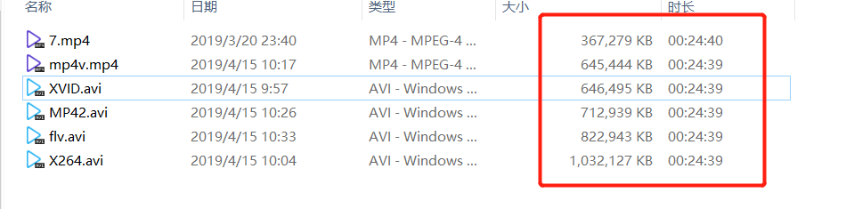

# 2019-04-15

## 完成事项
- [x] 测试opencv不同编解码器
- [x] 使用swig转换代码

## 编解码器

如图，原视频`7.mp4`本身368M, 最终`mp4v`和`XVID`表现相仿, 还是选择原来的`XVID`(因为小视频好像它的大小比`mp4v`好)

## Swig
简单使用了下`Swig`, 考虑到可能之前介绍说做dll, 转换成python没太多意义, 就当做学习一下。后续再看看怎么搞。

