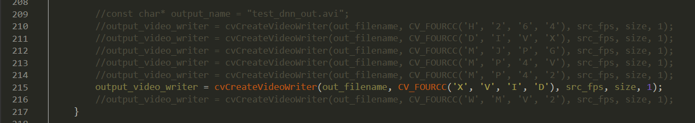

# 进度记录
每天都会做相应的记录, 记录当天学习和做了的事情, 以此来激励自己。

## 重要时间点
- 成功解决`darknet.exe`崩溃等各种问题[2019-03-17] (https://github.com/VonSdite/MonitoringVideoEffectiveExtraction/blob/master/ProgressDiary/2019-03-17.md)
- 完成智能模块API编写 [2019-03-25](https://github.com/VonSdite/MonitoringVideoEffectiveExtraction/blob/master/ProgressDiary/2019-03-25.md)
- 完成智能模块API的重构 [2019-03-27](https://github.com/VonSdite/MonitoringVideoEffectiveExtraction/blob/master/ProgressDiary/2019-03-27.md)

## 最新版编译方法
_指GPU版本_

**环境前提**
> - VS2015
> - cuda 10
> - cudnn 7.4 for cuda10
> - opencv 3.4.3
> - [darknet yolov3 - AlexeyAB version](https://github.com/AlexeyAB/darknet)最新版
> - 安装[xvid](https://www.xvidmovies.com/codec/)编解码器

**变量**
> - 设置系统变量`OpenCV_ROOT_DIR` = opencv 3.4.3 Release版本的build目录

> - 设置系统变量`CUDNN` = CUDNN所在的目录

> - 检查`CUDA_PATH`和`CUDA_PATH V10 0`这两个变量是否存在

> - 添加环境变量, 如图(一是CUDA的路径、一是opencv的路径)

**vs2015编译选项**
> - 添加`CUDA Toolkit Custom Dir`目录

> - 编译失败时, 可将**C/C++** - **高级** - **编译为** 修改为`编译为 C++ 代码 (/TP)`

**代码修改地方**
> - 修改`demo.c`的`output_video_writer`等于这个`output_video_writer = cvCreateVideoWriter(out_filename, CV_FOURCC('X', 'V', 'I', 'D'), src_fps, size, 1);`

## 踩过的坑
按遇到的坑的**先后顺序**排列。
- [x] **1. darknet GPU编译失败**。最终解决方案 vs2015、cuda10、cudnn7.4、~~opencv340~~opencv343、添加opencv链接库、包含目录opencv、CUDA C/C++路径。尝试过vs2017,失败。~~darknet能与opencv345**编译成功**, 但后续原因选择**只用**opencv340~~。 详情见: https://vonsdite.cn/posts/25f3339.html

- [x] **2. darknet GPU训练失败**。 查看显卡显存, 原因是显存不足, 在老师的`TiTan XP`上可以训练; 后也进行了`无GPU版本`训练

- [x] **3. GPU训练时加载图片路径报错, 乱码**。 无论是在自己的电脑还是老师的电脑, 均出现乱码问题。解决办法: 对于`VOC数据集`在生成`train.txt`的时候, 不要**模仿**官网linux命令来使用`powershell`的`cat命令`生成`train.txt`, 而应该考虑用py或者别的办法, 避免记事本最开始的**特殊十六进制字符**致使图片路径出错; 对于`COCO数据集`, 官网使用脚本`get_coco_dataset.sh`来获取数据, 毕竟是windows环境, 所以**手动逐行模仿执行**, 但是不要再去配置windows的`wget`、`unzip`、`tar`, **因为真的很慢**... 最后可以用`git bash`使用`awk`命令生成训练的图片路径, 但需要手动用`sublime`或者`notepad++` 替换掉前缀的`/`。详情见: https://vonsdite.cn/posts/e401f4af.html

- [x] **4. video目标检测导出的视频为0kb**。~~解决办法是使用`opencv340`, 不要使用除`opencv340`的版本, opencv345虽然可以编译成功, 但是导出视频是空的, 别的版本好像也是这种情况。~~ 安装编解码器[xvid](https://www.xvidmovies.com/codec/)解决

- [x] **5. video目标检测成功导出了视频, 但是缺少了视频时间和时间拖拉控制条**。 解决过程是, 考虑源码, **diff**了`release版本代码`和`lastest最新代码`, 更改`demo.c`中的 `exit(EXIT_FAILURE;)`为`return (void *)EXIT_FAILURE;`; 收到了作者的`Bug fixed`

- [x] ~~**6. 退出webcam摄像头时发生崩溃**。opencv 345不会崩溃, 但是不能导出视频, 解决办法调试darknet程序, 最终定位到是`ntdll.dll`的问题, 程序需要的是64位`ntdll.dll`, 将系统64位的`ntdll.dll`拖至`darknet.exe`附近。详情见: https://vonsdite.cn/posts/d94f737c.html~~

- [x] **7. webcam摄像头视频无法导出, 一导出程序就崩溃**。解决办法, 调试`darknet.exe`,  定位到**207行的fps的获取问题**, 加入判断解决。详情见: https://vonsdite.cn/posts/2faa3031.html 或者更换`opencv`版本

- [x] **8. 自己编译的opencv与darknet一起编译失败**, 解决办法: https://vonsdite.cn/posts/1a00e4df.html

- [x] **9. webcam摄像头调用仍然崩溃**。已经解决, 应该是`opencv3.4.0`的问题, 使用稍高版本的`opencv 3.4.3`可解决问题。 另外要**解决之前高版本导出视频0kb**的问题, 那就是需要安装一个编解码器, 比如[xvid](https://www.xvidmovies.com/codec/)
