# IntelligentMonitor

## TOC
1. [介绍](#介绍)
2. [目的](#目的)
3. [演示](#演示)
4. [提供的API功能介绍](#提供的API功能介绍)
    - 4.1 [API的用途](#API的用途)
    - 4.2 [API参数详细介绍](#API参数详细介绍)
5. [快速使用](#快速使用)
    - 5.1 [C++程序使用](#C++程序使用)
    - 5.2 [使用dont_show](#关于dont_show)
6. [如何编译](#如何编译)
7. [注意](#注意)
8. [TODO](#TODO)
9. [题外话](#题外话)

## 介绍
本项目是基于[darknet yolov3 - AlexeyAB version](https://github.com/AlexeyAB/darknet)进行的二次开发。
主要实现的是**智能视频监控模块开发**(动态链接库dll开发), 方便视频监控系统客户端进行**智能化**升级。

## 目的
传统的视频监控往往会记录着许多冗余数据, 这对于回看视频监控的操作人员来说, 将是一件枯燥而且艰难的工作。研究表明, 操作人员盯着电视墙超过10分钟, 就将漏掉90%的视频信息, 所以本课题旨在利用**深度学习框架YOLO**进行视频监控智能模块开发, 实现提取视频监控有效片段、人员计数等功能的DLL(动态链接库), 并提供相应调用的API接口, 从而使**视频监控系统**中的摄像机成为人的眼睛, 拓展视频监控系统的作用和能力, 实现非智能到智能地升级, 以此大幅度减少人力、物力、财力的投入。

### 演示

#### 计数图片上有多少人
使用`detect_something_appear_times`
```C++
// names_file 是yolo能识别的所有目标名, 比如coco.names
// cfg_file 是yolo的cfg文件, 比如yolov3-tiny.cfg
// weights 是yolo的weights权重文件, 比如yolov3-tiny.weights
IntelligentMonitor monitor = IntelligentMonitor(
                                names_file, 
                                cfg_file, 
                                weights_file
                            );
std::string pic_file = "test_data/people_test.jpg"
std::cout << "person: " <<
       monitor.detect_something_appear(pic_file.c_str(), "person", true, "test_save_file/predict_people.jpg")
       << std::endl;
```
原图:


结果:
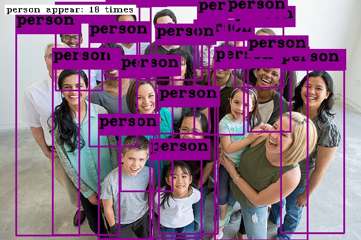

原图上实际有19个人, 检测到18个人, **正确率还是杠杠的** 
(使用yolov3.weights - [YOLOv3-416](https://pjreddie.com/media/files/yolov3.weights))

#### 计数视频中所有能检测对象出现的次数
演示`detect_all_appear_times` API, 用于检测视频画面上**所有能检测到的对象**出现的次数


左上角会标注出出现的次数。
可以通过设置
- `bool draw_box`来控制是否要显示框住的对象的框
- `bool show_times`来控制左上角是否显示检测到对象出现的次数

(使用yolov3.weights - [YOLOv3-416](https://pjreddie.com/media/files/yolov3.weights))
#### 提取视频有效片段
原视频路径: https://vd1.bdstatic.com/mda-hhfrc6w2sh38kh1s/sc/mda-hhfrc6w2sh38kh1s.mp4?auth_key=1553656663-0-0-ed14309fc809c2c477396b1d5ee95ff3&bcevod_channel=searchbox_feed&pd=bjh&abtest=all

原视频共有**54秒**, 通过`extract`提取有人出现的画面得到**43秒**视频, 实际有人出现的时间约为**45秒**。
其中设置了disappear_thresh为5, 表示视频中检测的人消失了5秒, 认定不再出现, 再出现就在新的片段中。

检测的片段:
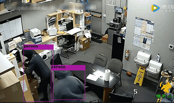

```c++
// 本演示调用时, 设置的参数
// 设置了检测对象为"person"
// disappear_thresh为5, 表示视频中检测的对象消失了5秒, 认定不再出现, 再出现就在新的片段中
// draw_box设为了true
INTELLIGENT_API bool extract(
    cv::VideoCapture& cap,
    std::vector<char *>& obj_to_extract,
    const char* save_path = "./",
    const char * prefix = NULL,
    int disappear_thresh = DISAPPEAR_THREASH,
    bool draw_box = false,
    float thresh = DEFAULT_THREASH,
    double* progress_rate = NULL
);
```


**其他API**的使用参看`IntelligentMonitor_console_demo.sln`

或见[API参数详细介绍](#API参数详细介绍)

## 提供的API功能介绍
```C++
// 提取视频有效片段, 有2个重载函数
// 支持输入视频文件或cv::VideoCapture对象
// 可设置要提取的目标对象
// 可设置目标最大消失阈值, 即目标在画面消息了多少秒分一个片段
// 可选择是否要绘制框住对象的框
// 多线程可获取进度
// 可设置导出视频的路径、命名前缀
// 可设置置信度阈值下限(即分类时若大于该值, 才认定对象属于该分类)
// 可设置每检测一帧, 跳过几帧, 加快提取速度
INTELLIGENT_API extract(...);       

// 检测目标是否出现, 有4个重载函数
// 支持单个目标检测, 或一组目标检测
// 可框住检测到的目标
// 可设置处理后的图片的保存
// 可设置置信度阈值下限(即分类时若大于该值, 才认定对象属于该分类)
INTELLIGENT_API bool detect_something_appear(...);

// 检测目标出现次数, 有4个重载函数
// 支持单个目标检测, 或一组目标检测
// 可框住检测到的目标
// 可左上角显示各目标出现次数
// 可设置处理后的图片的保存
// 可设置置信度阈值下限(即分类时若大于该值, 才认定对象属于该分类)
INTELLIGENT_API int detect_something_appear_times(...);

// 检测画面所有目标出现次数, 有2个重载函数
// 可框住检测到的目标
// 可左上角显示各目标出现次数
// 可设置处理后的图片的保存
// 可设置置信度阈值下限(即分类时若大于该值, 才认定对象属于该分类)
INTELLIGENT_API void detect_all_appear_times(...);
```

### API的用途
#### `extract`
**可应用的场景**:
1. 传统的视频监控系统保存着很多录像记录, 这些录像记录中存在着**许多冗余片段**, 可使用这个API来剔除冗余视频内容, 减少操作员回看负担

#### `detect_something_appear`
返回值是布尔值

**可应用的场景**:
1. 视频监控系统可使用该API来**判断何时需要进行录像**, 以此剔除冗余视频内容, 使有效存储周期提升(因为存储空间有限, 监控摄像头一般满了就会覆盖存储, 而剔除了冗余的内容, 就有更多的空间来保存有效视频内容, 而且还减少了回看操作员的负担)
2. 视频监控系统可使用该API来**设置看护区域**, 即某些看护区域在某段时间内不允许有人出入, 就可以使用该API来实现该功能, 且还能利用这个来判断当有人出现在看护区域时, 进行**响铃报警**或者**短信通知主人**(地铁高速公路等禁止进入的区域和场所; 晚上睡觉, 想把大门口设置为看护区域; 银行押运钱时, 设置某区域为看护区域;幼儿园午觉, 用来看护哪些调皮蛋偷偷跑出来)

#### `detect_somthing_appear_times` `detect_all_appear_times`
`detect_somthing_appear_times`和`detect_all_appear_times`功能相似

**可应用的场景**:
1. 视频监控可以使用该API来实现**计数**, 比如**路口车辆通过数**, 或者**统计路口行人密度**, 或者**统计公交车上拥挤程度**, 或者为**以进行人流量的统计**, 为商业网点、大型超市等提供依据, 方便业务分析
2. 视频监控可以使用该API来实现**人员聚集检测**, 对指定区域内出现的人员非法集中、群体性事件进行报警, 可以广泛用于广场、政府机关等场所, 避免非法游行集会等恶性事件发生。

**更多的扩展**:
因为只要更换**cfg文件**和**weights权重文件**(前提是使用数据训练好), 就可以实现更多目标检测, 比如视频监控对**违禁物品**的监控等

## 快速使用
前提是部署好所需的[环境](#环境)

### C++程序使用
1. 将`include`目录包含到你的**Visual Studio**项目中
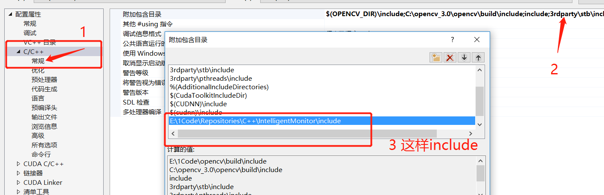
2. 将`IntelligentMonitor.lib`文件附加到你的项目中
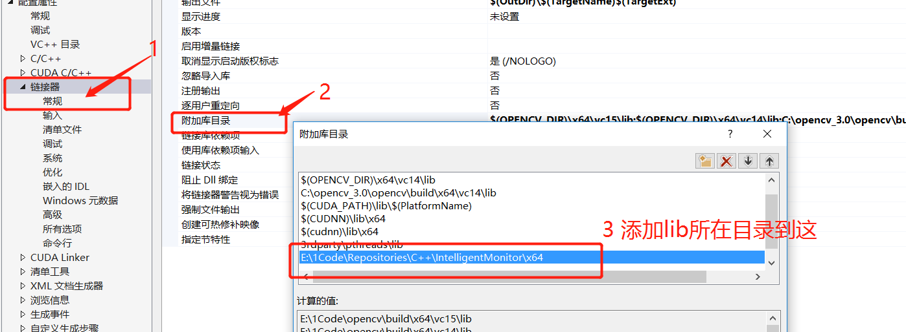
3. 在你的代码中, 使用`#include "intelligent_monitoring.h"`, 并加上`#pragma comment(lib, "IntelligentMonitor.lib")`
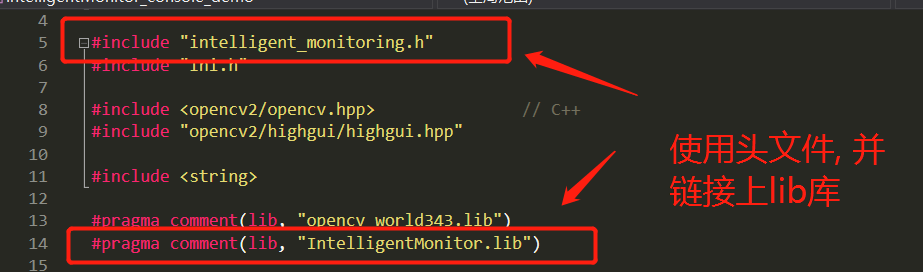
4. 之后就可以使用`IntelligentMonitor` 这个类, 比如
```C++
#include "intelligent_monitoring.h"
#include <opencv2/opencv.hpp>          // C++
#include "opencv2/highgui/highgui.hpp"  
#include <string>
#include <vector>
#include <map>

#pragma comment(lib, "opencv_world343.lib")
#pragma comment(lib, "IntelligentMonitor.lib")

// names_file 是yolo能识别的所有目标名, 比如coco.names
// cfg_file 是yolo的cfg文件, 比如yolov3-tiny.cfg
// weights 是yolo的weights权重文件, 比如yolov3-tiny.weights
IntelligentMonitor monitor = IntelligentMonitor(
                                names_file, 
                                cfg_file, 
                                weights_file
                            );

std::vector<char *> obj_to_detect;
obj_to_detect.push_back("person");
obj_to_detect.push_back("car");

// 提取视频"test.mp4"中有出现person、car画面的视频片段
// 保存到当前目录的./test_file中
// 并且命名以"pre"做前缀
// 5代表person、car出现的画面, 这些检测目标最大消失时间, 超过5秒则提取为一个片段
// true 表示绘制框框框住检测到的对象
monitor.extract("test.mp4", obj_to_detect, "./test_file", "pre", 5, true)

// 判断"dog.jpg"中是否有dog出现, 并框住检测到的dog, 保存到save_file/predict_dog.jpg下, 返回bool
monitor.detect_something_appear("dog.jpg", "dog", true, "save_file/predict_dog.jpg");

// 计数"dog.jpg"中dog出现的次数, 并框住检测到的dog, 保存到save_file/predict_dog.jpg下, 返回int
monitor.detect_something_appear_times("dog.jpg", "dog", true, "save_file/predict_dog.jpg");

// 统计视频中所有能检测到的目标出现的次数, 并框住检测到的对象, 以及左上角显示计数
cv::VideoCapture capture;
std::map<std::string, int> in_map;

capture.open(test_file);
if (!capture.isOpened())
    printf("文件打开失败");

while (true)
{
    capture >> frame;
    if (frame.empty()) break;
    monitor.detect_all_appear_times(frame, in_map, true, true);
    for (auto &j : in_map)
        std::cout << j.first << " appear: " << j.second << std::endl;
    cv::imshow("window name1", frame);
    cv::waitKey(1);
}
```

## 如何编译
这里主要说明如何编译出`IntelligentMonitor.dll`

### 环境
- 需要显卡支持**CUDA**
- **Windows** 
- **Visual Studio 2015**
- **CUDA 10.0**: https://developer.nvidia.com/cuda-toolkit-archive 
- **cuDNN 7.4 for CUDA 10.0**: https://developer.nvidia.com/rdp/cudnn-archive
- **Opencv 4.1.0**: https://opencv.org/releases.html
- **安装[xvid](https://www.xvidmovies.com/codec/)编解码器**: https://www.xvidmovies.com/codec

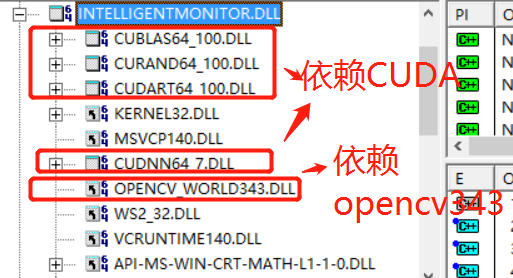

> 参照这篇文章进行配置**CUDA**和**cuDNN**: https://vonsdite.cn/posts/c6b151e6.html

> 或者参照官网进行配置**CUDA**和**cuDNN**: https://docs.nvidia.com/deeplearning/sdk/cudnn-install/index.html#installwindows

### 变量设置
- 设置**系统变量**`OpenCV_ROOT_DIR` = opencv 3.4.3 Release版本的**build**目录
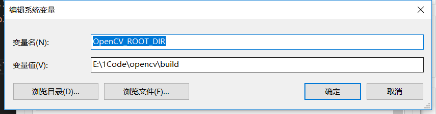
- 设置**系统变量**`CUDNN` = **CUDNN所在的目录**
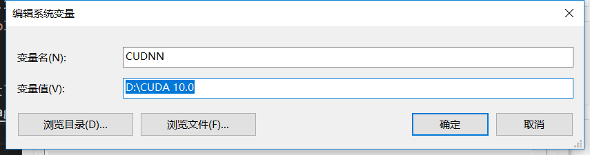
- 检查`CUDA_PATH`和`CUDA_PATH V10 0`这两个变量是否存在
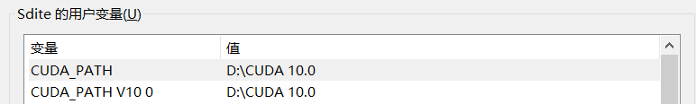
- 添加**环境变量**, 如图(一是CUDA的路径、一是opencv的路径)
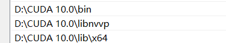
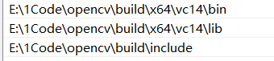

### 进行编译
1. **Visual Studio 2015**打开`IntelligentMonitor.sln`
2. 修改项目工程为**Release x64**
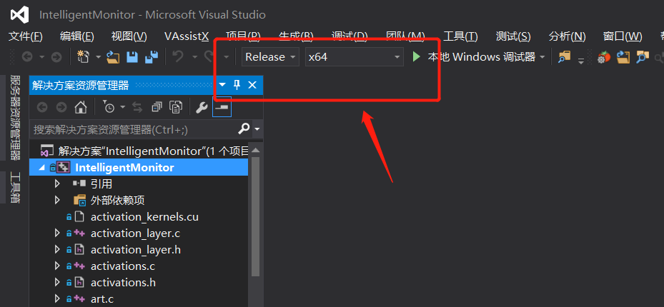
3. 添加`CUDA Toolkit Custom Dir`目录(根据**自己的情况**来设置)
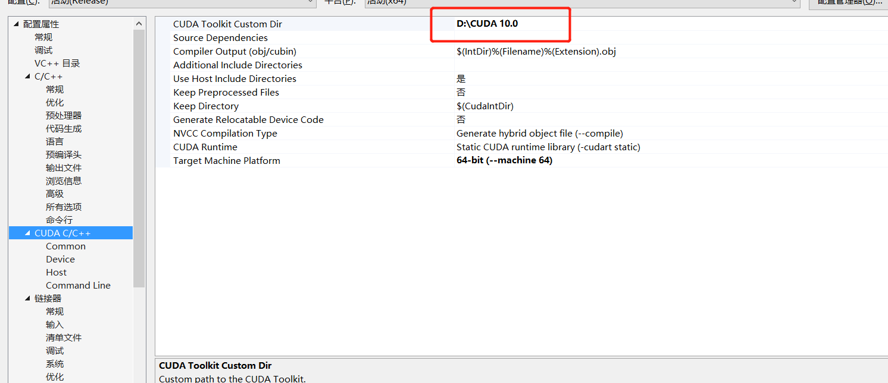
4. 可将**C/C++** - **高级** - **编译为** 修改为`编译为 C++ 代码 (/TP)`
5. 点击**生成** - **重新生成IntelligentMonitor (E)**, 即可生成`IntelligentMonitor.dll`
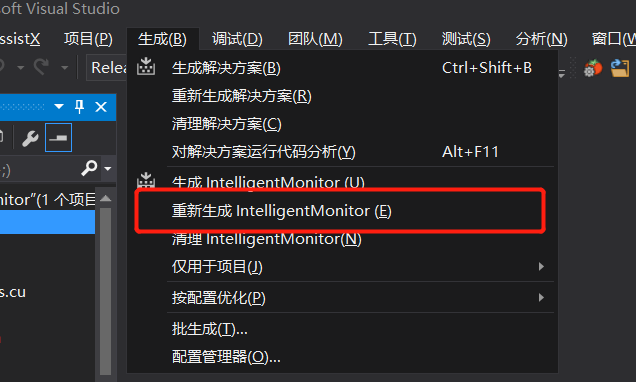

**成功编译**, 真的恭喜你, 我走过太多的坑了!
If you finish all the above, then you are good to go.

## API参数详细介绍
### `extract`
用于提取视频中出现某些目标对象的片段

<details>
<summary>函数声明</summary>

```c++
/*
参数:
    cv::VideoCapture& cap:                      视频捕获对象(请不要传摄像头的)
    std::vector<char *>& obj_to_extract:        需要提取的视频中所包含的目标组
    const char* save_path="./":                 提取出来的视频保存的路径
    const char * prefix=NULL:                   提取出来的视频命名的前缀
    int disappear_thresh=DISAPPEAR_THREASH:     所检测的目标最大消失的阈值, 秒为单位;
                                                比如设置为5,表示5秒内目标没出现, 则分一个片段
    bool draw_box=false:                        是否需要绘制框住目标的框框
    float thresh=DEFAULT_THREASH:               置信度的下限(即分类时若大于该值, 才认定对象属于该分类)
    double* progress_rate=NULL:                 提取的进度率, 多线程的时候可以拿这个来显示进度
    int interval_frame = 0:                     设置每检测一帧后跳过几帧, 加快检测速度

返回值:
    bool:                                       表明提取是否成功
*/
INTELLIGENT_API bool extract(
    cv::VideoCapture& cap,
    std::vector<char *>& obj_to_extract,
    const char* save_path = "./",
    const char * prefix = NULL,
    int disappear_thresh = DISAPPEAR_THREASH,
    bool draw_box = false,
    float thresh = DEFAULT_THREASH,
    double* progress_rate = NULL,
    int interval_frame = 0
);

/*
参数:
    const char* video_file:                     视频文件的路径
    std::vector<char *>& obj_to_extract:        需要提取的视频中所包含的目标组
    const char* save_path="./":                 提取出来的视频保存的路径
    const char * prefix=NULL:                   提取出来的视频命名的前缀
    int disappear_thresh=DISAPPEAR_THREASH:     所检测的目标最大消失的阈值, 秒为单位;
                                                比如设置为5,表示5秒内目标没出现, 则分一个片段
    bool draw_box=false:                        是否需要绘制框住目标的框框
    float thresh=DEFAULT_THREASH:               置信度的下限(即分类时若大于该值, 才认定对象属于该分类)
    double* progress_rate=NULL:                 提取的进度率, 多线程的时候可以拿这个来显示进度
    int interval_frame = 0:                     设置每检测一帧后跳过几帧, 加快检测速度

返回值:
    bool:                                       表明提取是否成功
*/
INTELLIGENT_API bool extract(
    const char* video_file,
    std::vector<char *>& obj_to_extract,
    const char* save_path = "./",
    const char * prefix = NULL,
    int disappear_thresh = DISAPPEAR_THREASH,
    bool draw_box = false,
    float thresh = DEFAULT_THREASH,
    double* progress_rate = NULL,
    int interval_frame = 0
);
```

</details>

### `detect_all_appear_times`
检测画面上所有对象出现的次数

<details>
<summary>函数声明</summary>

```c++
/*
参数:
    cv::Mat& mat:                       图片或者视频某帧的矩阵
    std::map<std::string, int>& in_map: 保存检测的对象出现次数的映射表
    bool draw_box=false:                是否绘制框住对象的框
    bool show_times=false:              是否显示检测对象的出现次数
    const char* save_file_name=NULL:    保存处理后的图片名, NULL表示不保存
    float thresh=DEFAULT_THREASH:       置信度的下限(即分类时若大于该值, 才认定对象属于该分类)

返回值:
    无返回值, 次数保存在in_map中
*/
INTELLIGENT_API void detect_all_appear_times(
    cv::Mat& mat,
    std::map<std::string, int>& in_map,
    bool draw_box = false,
    bool show_times = false,
    const char* save_file_name = NULL,
    float thresh = DEFAULT_THREASH
);

/*
参数:
    const char* image_filename:         图片名
    std::map<std::string, int>& in_map: 保存检测的对象出现次数的映射表
    bool draw_box=false:                是否绘制框住对象的框
    bool show_times=false:              是否显示检测对象的出现次数
    const char* save_file_name=NULL:    保存处理后的图片名, NULL表示不保存
    float thresh=DEFAULT_THREASH:       置信度的下限(即分类时若大于该值, 才认定对象属于该分类)

返回值:
    无返回值, 次数保存在in_map中
*/
INTELLIGENT_API void detect_all_appear_times(
    const char* image_filename,
    std::map<std::string, int>& in_map,
    bool draw_box = false,
    bool show_times = false,
    const char* save_file_name = NULL,
    float thresh = DEFAULT_THREASH
);
```
</details>


### `detect_somthing_appear_times`
检测某物出现的次数, 返回值是`int`
<details>
<summary>函数声明</summary>

```c++
/*
参数:
    cv::Mat& mat:                       图片或者视频某帧的矩阵
    const char* something:              检测的对象
    bool draw_box=false:                是否绘制框住对象的框
    bool show_times=false:              是否显示检测对象的出现次数
    const char* save_file_name=NULL:    保存处理后的图片名, NULL表示不保存
    float thresh=DEFAULT_THREASH:       置信度的下限(即分类时若大于该值, 才认定对象属于该分类)

返回值:
    int:                                表明检测对象出现的次数
*/
INTELLIGENT_API int detect_something_appear_times(
    cv::Mat& mat,
    const char* something,
    bool draw_box = false,
    bool show_times = false,
    const char* save_file_name = NULL,
    float thresh = DEFAULT_THREASH
);

/*
参数:
    const char* image_filename:         图片名
    const char* something:              检测的对象
    bool draw_box=false:                是否绘制框住对象的框
    bool show_times=false:              是否显示检测对象的出现次数
    const char* save_file_name=NULL:    保存处理后的图片名, NULL表示不保存
    float thresh=DEFAULT_THREASH:       置信度的下限(即分类时若大于该值, 才认定对象属于该分类)

返回值:
    int:                                表明检测对象出现的次数
*/
INTELLIGENT_API int detect_something_appear_times(
    const char* image_filename,
    const char* something,
    bool draw_box = false,
    bool show_times = false,
    const char* save_file_name = NULL,
    float thresh = DEFAULT_THREASH
);

/*
参数:
    cv::Mat& mat:                       图片或者视频某帧的矩阵
    std::vector<char*>& something:      检测的一组对象
    std::map<std::string, int>& in_map: 记录检测对象出现的次数
    bool draw_box=false:                是否绘制框住对象的框
    bool show_times=false:              是否显示检测对象的出现次数
    const char* save_file_name=NULL:    保存处理后的图片名, NULL表示不保存
    float thresh=DEFAULT_THREASH:       置信度的下限(即分类时若大于该值, 才认定对象属于该分类)

返回值:
    无返回值, 次数保存在in_map中
*/
INTELLIGENT_API void detect_something_appear_times(
    cv::Mat& mat,
    std::vector<char*>& something,
    std::map<std::string, int>& in_map,
    bool draw_box = false,
    bool show_times = false,
    const char* save_file_name = NULL,
    float thresh = DEFAULT_THREASH
);

/*
参数:
    const char* image_filename:             图片名
    std::vector<char*>& something:          检测的一组对象
    std::map<std::string, int>& in_map:     记录检测对象出现的次数
    bool draw_box=false:                    是否绘制框住对象的框
    bool show_times=false:                  是否显示检测对象的出现次数
    const char* save_file_name=NULL:        保存处理后的图片名, NULL表示不保存
    float thresh=DEFAULT_THREASH:           置信度的下限(即分类时若大于该值, 才认定对象属于该分类)

返回值:
    无返回值, 次数保存在in_map中
*/
INTELLIGENT_API void detect_something_appear_times(
    const char* image_filename,
    std::vector<char*>& something,
    std::map<std::string, int>& in_map,
    bool draw_box = false,
    bool show_times = false,
    const char* save_file_name = NULL,
    float thresh = DEFAULT_THREASH
);
```

</details>

### `detect_something_appear`
检测某物是否出现, 返回值是`bool`

<details>
<summary>函数声明</summary>

```c++
/*
参数:
    cv::Mat& mat:                       图片或者视频某帧的矩阵
    const char* something:              检测的对象
    bool draw_box=false:                是否绘制框住对象的框
    const char* save_file_name=NULL:    保存处理后的图片名, NULL表示不保存
    float thresh=DEFAULT_THREASH:       置信度的下限(即分类时若大于该值, 才认定对象属于该分类)

返回值:
    bool:                               表明检测对象是否出现
*/
INTELLIGENT_API bool detect_something_appear(
    cv::Mat& mat,
    const char* something,
    bool draw_box = false,
    const char* save_file_name = NULL,
    float thresh = DEFAULT_THREASH
);

/*
参数:
    const char* image_filename:         图片名
    const char* something:              检测的对象
    bool draw_box=false:                是否绘制框住对象的框
    const char* save_file_name=NULL:    保存处理后的图片名, NULL表示不保存
    float thresh=DEFAULT_THREASH:       置信度的下限(即分类时若大于该值, 才认定对象属于该分类)

返回值:
    bool:                               表明检测对象是否出现
*/
INTELLIGENT_API bool detect_something_appear(
    const char* image_filename,
    const char* something,
    bool draw_box = false,
    const char* save_file_name = NULL,
    float thresh = DEFAULT_THREASH
);

/*
参数:
    cv::Mat& mat:                       图片或者视频某帧的矩阵
    std::vector<char*>& something:      检测的一组对象
    bool draw_box=false:                是否绘制框住对象的框
    const char* save_file_name=NULL:    保存处理后的图片名, NULL表示不保存
    float thresh=DEFAULT_THREASH:       置信度的下限(即分类时若大于该值, 才认定对象属于该分类)

返回值:
    bool:                               只要对象组中一个对象出现, 就返回true, 全没出现, 返回false
*/
INTELLIGENT_API bool detect_something_appear(
    cv::Mat& mat,
    std::vector<char*>& something,
    bool draw_box = false,
    const char* save_file_name = NULL,
    float thresh = DEFAULT_THREASH
);

/*
参数:
    const char* image_filename:         图片名
    std::vector<char*>& something:      检测的一组对象
    bool draw_box=false:                是否绘制框住对象的框
    const char* save_file_name=NULL:    保存处理后的图片名, NULL表示不保存
    float thresh=DEFAULT_THREASH:       置信度的下限(即分类时若大于该值, 才认定对象属于该分类)

返回值:
    bool:                               只要对象组中一个对象出现, 就返回true, 全没出现, 返回false
*/
INTELLIGENT_API bool detect_something_appear(
    const char* image_filename,
    std::vector<char*>& something,
    bool draw_box = false,
    const char* save_file_name = NULL,
    float thresh = DEFAULT_THREASH
);
```
</details>

### 关于`dont_show`
该API的调用, 需要有以下文件支持:
> - names_file -> 训练yolo权重时, 记录所有分类名的文件, 例如`coco.names`

> - cfg_file -> 训练yolo权重时, 所使用的cfg文件, 例如`yolov3-tiny.cfg`

> - weights_file -> 训练yolo权重, 最后得到的权重文件, 例如`yolov3-tiny.weights`


使用`dont_show`, 可以提高**权重文件**的**利用率**
为了灵活使用训练好的权重文件, 可以在`names_file`中的分类对象前加入`dont_show`来表示不检测该物体, 以此来减少干扰
比如, 只想检测行人, 就可以在`names_file`加入`dont_show`来实现该功能


上图就是只检测人的结果


## 注意
- 目录`ProgressDiary/`保存本项目的**进度历程**
- 目录`IntelligentMonitor_console_demo_src`目录存放的是`IntelligentMonitor_console_demo.sln`命令行示例程序代码
- 目录`src`保存的是本项目`IntelligentMonitor.sln`的源代码, `include`和`3rdparty`也是
- 目录`x64`是本项目编译生成文件的目录, 还保存着**yolo**所需的`cfg`、`data`目录, **yolo**的**权重文件**需要到https://pjreddie.com/darknet/yolo/下载

## TODO
- 接下来将进行的事:
    * [x] 成功编译 `darknet.exe`
    * [X] 修复`darknet.exe`, 使其成功支持**图像识别**、**视频识别**、**摄像头识别**(因为我编译出来总是崩溃或出错)
    * [X] 修复**视频/摄像头识别结果**保存问题
    * [X] 完成智能模块DLL开发
    * [ ] 制作MFC演示程序, 做一个好看的界面
    * [ ] 获取数据, 训练一个新的权重模型进行检测

## 题外话
在[darknet yolov3 - AlexeyAB version](https://github.com/AlexeyAB/darknet)提了多个**Issue**, 帮助作者**Bug fixed**


## Cite
```
@misc{darknet13,
  author =   {Joseph Redmon},
  title =    {Darknet: Open Source Neural Networks in C},
  howpublished = {\url{http://pjreddie.com/darknet/}},
  year = {2013--2016}
}
```